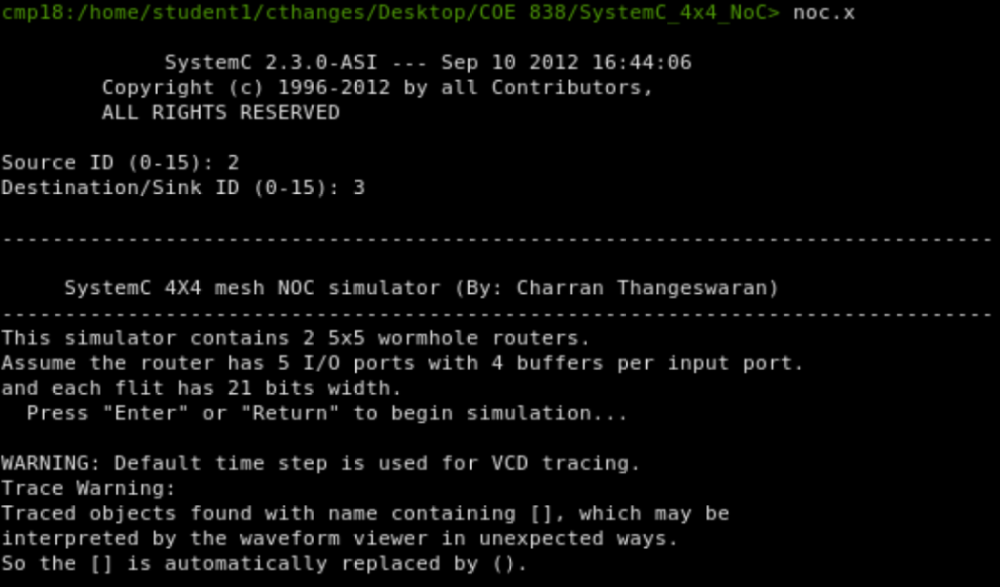
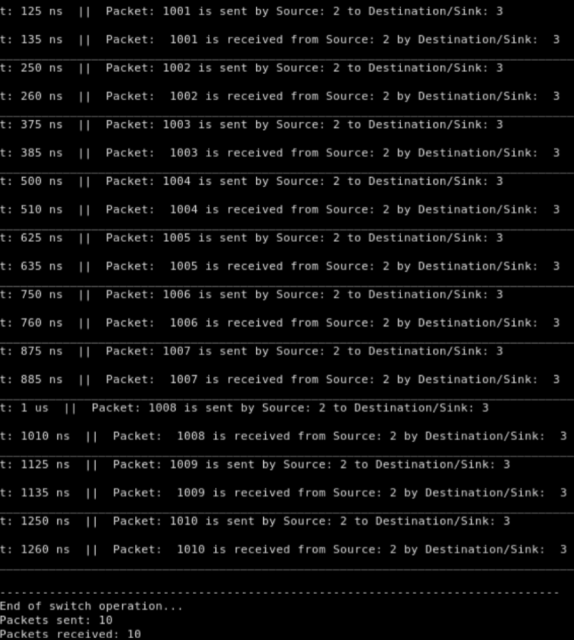
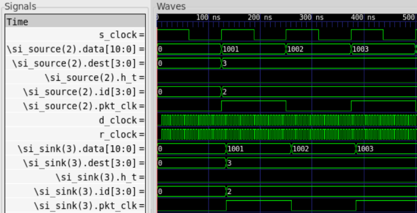

# 4x4 NoC
## Summary
The purpose of this project is to model and simulate an NoC (Network-on-Chip) using SystemC.This NoC consists of routers (switches) and IPs (hardware modules) for implementation, which are all provided in the form of SystemC code for a basic 1x2 mesh NoC. Specifically, the code for the packet structure, source module, sink module, router module, arbiter module, FIFO buffer module, crossbar switch module, and the main simulation module are all provided. By using the information provided in the project manual and understanding the 1x2 mesh NoC code, a fully-functional 4x4 mesh NoC can be developed; this involves modifying various files to ensure proper communication between the source and the sink cores in a 4x4 mesh topology.

## Features
- **Packet structure**: Fixed-width flits with fields for data (11-bit), source ID (4-bit), destination ID (4-bit), an imaginary packet clock bit, and a header/tail bit; packet length is fixed at 5 flits with the tail on every 5th flit

- **Source module**: Sends packets only when its ID matches the selected source ID and the input ack allows; increments data each send, sets destination from user input, and prints send timestamps

- **Sink module**: Accepts packets, asserts ack on packet events, records receive time, and prints received packet details (no explicit latency computation)

- **Router module**: Binds FIFO, arbiter, and crossbar submodules and counts incoming packet events; forwarding is handled by the submodules

- **Arbiter module**: Performs XY-style routing decisions and grants outputs based on destination ID bits and output availability, scaled for 4x4 addressing

- **FIFO buffer module**: 4-entry input buffer per port with request/grant handshake; issues requests when non-empty and outputs flits on grant

- **Crossbar switch module**: Routes each input to an output based on the arbiter’s configuration, covering all output ports

- **Main NoC simulation module**: Instantiates 16 sources, 16 routers, and 16 sinks; wires the 4x4 mesh interconnect and ack signals; prompts for source/destination IDs; runs the simulation clock; and generates VCD traces

## Simulation
This is just an example of many possible scenarios:

  

Figure 1: Start of 4x4 mesh NoC simulation (Source ID: 2, Destination ID: 3).

  

Figure 2: Transmission of 10 packets between Source 2 and Sink 3.

  

Figure 3: GTKWave Simulation Results.

